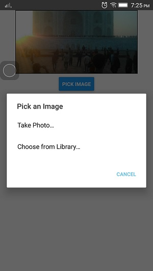

# react-native-image-picker

This repository contains a React Native project which i implement the [react-native-image-picker](https://github.com/react-community/react-native-image-pickerr) package.
In this picked the image from gallery or take the image from cammera.

[demo apk](./app-debug.apk)

## Installation
## npm install react-native-datepicker --save
### Development

1. Clone this repo.
2. Run `npm install`.
3. Ensure a device, or emulated Android image is connected (`adb devices`).
4. Run `react-native run-android`.
     or
5. Run 'react-native run-ios'.

#### get more detail from [react-native-image-picker](https://github.com/react-community/react-native-image-pickerr).
